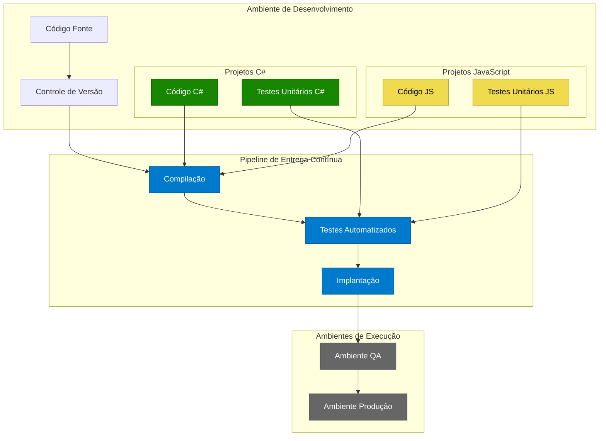

# Plano de Melhoria - Pipeline CI/CD
## Visão Geral da Proposta

Para melhorar a eficiência das entregas, vamos implementar um pipeline de entrega contínua (CI/CD) que integre tanto o ambiente C# quanto JavaScript. Esta abordagem permitirá:

* Automatização dos testes manuais
* Implantação automática
* Melhor qualidade do código
* Redução significativa do tempo de entrega

## Plano de Implementação por Etapa

### Etapa 1: Infraestrutura Básica (Mês 1-2)

#### Configuração do Ambiente
* Implementação do GitLab/GitHub para controle de versão
* Configuração inicial do pipeline básico
* Definição das políticas de branch e pull requests

#### Ferramentas Escolhidas
* GitLab CI/CD ou GitHub Actions para pipeline
* Azure DevOps para gerenciamento de projetos
* SonarQube para análise de qualidade de código

### Etapa 2: Automatização de Testes (Mês 3-4)

#### Para C#
* Implementação do xUnit para testes unitários
* Configuração do SpecFlow para BDD
* Integração com Selenium para testes de interface

#### Para JavaScript
* Implementação do Jest para testes unitários
* Configuração do Cypress para testes E2E
* Integração com Playwright para testes de interface

### Etapa 3: Pipeline de Implantação (Mês 5-6)

#### Automação de Build
* Configuração de compilação automática
* Gerenciamento de dependências
* Optimização de assets

#### Deploy Automático
* Implantação gradual (canary releases)
* Rollback automático
* Monitoramento de saúde da aplicação

### Etapa 4: Monitoramento e Otimização (Mês 7-12)

#### Métricas e Monitoramento
* Implementação de dashboards de métricas
* Monitoramento de performance
* Acompanhamento de cobertura de testes

#### Otimizações Contínuas
* Refinamento do pipeline
* Adição de novos tipos de testes
* Otimização de tempo de deploy

## Benefícios Esperados

1. Redução do tempo médio de entrega de 80%
2. Diminuição de 90% nos erros de implantação
3. Aumento de 60% na confiabilidade dos deploys
4. Redução de 40% no tempo gasto com testes manuais

## Considerações Finais

Esta migração deve ser feita de forma gradual, permitindo que a equipe se adapte às novas práticas sem comprometer as entregas atuais. É importante realizar treinamentos específicos para cada nova ferramenta e documentar todo o processo para facilitar a manutenção futura.

A equipe de três pessoas pode dividir as responsabilidades assim:
* Um membro focando na infraestrutura e pipeline
* Outro na automatização dos testes
* O terceiro na documentação e suporte à equipe

Esta estruturação permitirá uma transição suave do modelo tradicional para um ambiente mais moderno e eficiente, mantendo a sinergia entre as tecnologias C# e JavaScript.